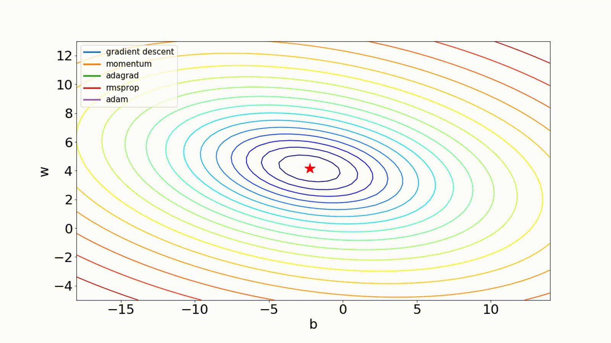
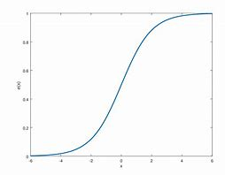
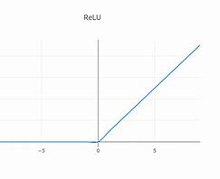
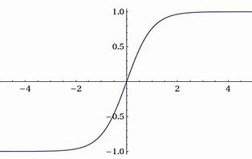
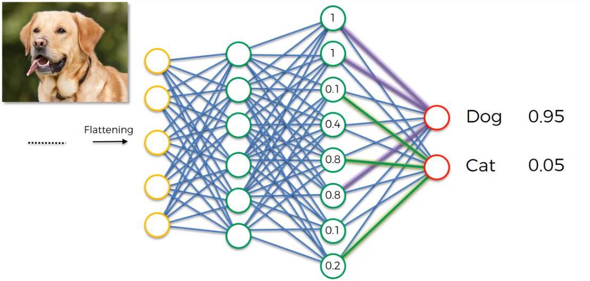
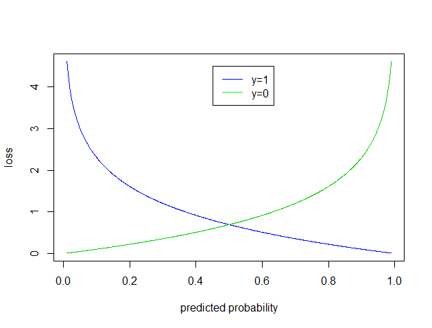
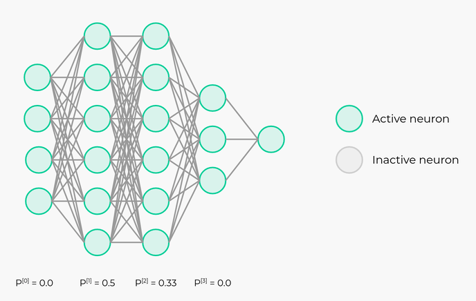
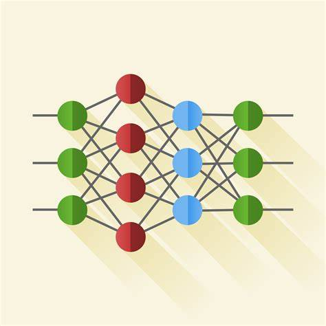

# NNs-from-scratch-using-NumPy
Standard Neural Network implementation From Scratch using Numpy, it contains key concepts of Neural networks training, Vectorization, and optimization techniques


## Table of Contents
- [Breaking It Down!](#breaking-it-down)
- [Usage](#usage)
- [Dependencies](#dependencies)
- [references](#references)


## Breaking It Down!
The `ClassifierNN` class can be broken down into 4 main parts:
1. [Initialization of the parameters](#initialization)
2. [Training](#training)
3. [Prediction](#prediction)
4. [Accuracy](#accuracy)
5. [supported techniques for better training](#supported-techniques-for-better-training)

### Initialization
In the initialization step, We Configure the Input shape, The Number of Layers in the Neural Network, The Number of Neurons in each layer, and the Activation Function for each layer. 

then we initialize the weights and biases of the NN using one of 2 methods 
1. `Random Initialization`
in this method, We sample the weights and biases from a normal distribution with a mean of 0 and a standard deviation of 1. Then, we scale the weights by multiplying them by 0.01 to make the weights small and close to zero. This is done to prevent the gradients from exploding or vanishing during the training process.

```python
def initialize_parameters(self, initialization_method = "he"):
# ... some code ...
if initialization_method == "random":
                # in random initialization we sample from a normal distribution with mean 0 and variance 1 and then multiply by 0.01 to make the variance 0.01 -small weights-
                parameters['W' + str(l)] = np.random.randn(self.layer_dims[l], self.layer_dims[l-1]) * 0.01
                parameters['b' + str(l)] = np.zeros((self.layer_dims[l], 1))
```

2. `He Initialization` 
he initialization, is a method that initializes the weights of the neural network in such a way that the variance of the weights is inversely proportional to the number of neurons in the previous layer. This method is used to prevent the gradients from exploding or vanishing during the training process, and leads to faster convergence of the neural network. This method is the default initialization method used in the code.

```python
def initialize_parameters(self, initialization_method = "he"):
# ... some code ...

elif initialization_method == "he":
                # in he initialization we sample from a normal distribution with mean 0 and variance 2/n[l-1] where n[l-1] is the input to the layer 
                parameters['W' + str(l)] = np.random.randn(self.layer_dims[l], self.layer_dims[l-1]) * np.sqrt(2/self.layer_dims[l-1])
                parameters['b' + str(l)] = np.zeros((self.layer_dims[l], 1))
```

### Training
The code to train the neural network consits of 3 major parts 
1. Configuring the optimization algorithm
2. Setting up mini-batches
3. The Training Loop
    - Forward Propagation
    - Compute the Loss
    - Backward Propagation
    - Update the Parameters

#### **Configuring the optimization algorithm**
There are several optimization algorithms that are suported in the code, the user can choose one of the following:
1. `gd` 
The basic gradient descent, which is the default in the code, it updates the weights and biases using the gradients of the loss function with respect to the weights and biases. The formula is given by:
    $$W^{(l)} = W^{(l)} - \alpha \frac{\partial L}{\partial W^{(l)}}$$
    $$b^{(l)} = b^{(l)} - \alpha \frac{\partial L}{\partial b^{(l)}}$$

2. `Momentum`
Momentum uses something called an exponentially weighted average of the gradients to update the weights and biases. if the network is oscillating, then the fraction of the previous update that is added to the current update will be smaller, which would slightly decrease the oscillations. On the other hand, if the network is going in the right direction, then the fraction of the previous update that is added to the current update will be larger, which would increase the speed of convergence. The formula is given by:
    $$V_{dW} = \beta V_{dW} + (1 - \beta) dW$$
    $$V_{db} = \beta V_{db} + (1 - \beta) db$$
first we calculate the moving average of the gradients, then we update the weights and biases using the following formulas:
    $$W = W - \alpha V_{dW}$$
    $$b = b - \alpha V_{db}$$

```python
def initialize_averages(self, parameters, optimizer):
# ... some code ...
if optimizer == "momentum":
            v = {} 
            for l in range(1, L + 1):
                v["dW" + str(l)] = np.zeros(parameters["W" + str(l)].shape)
                v["db" + str(l)] = np.zeros(parameters["b" + str(l)].shape)

            return v
# ... some code ...
```
3. `RMSprop`
RMSprop is an optimization algorithm that is based on the same principle of using an exponentially weighted averages. The difference is that in here the squared gradients are used to update the weights and biases. The formulas are given by:
    $$S_{dW} = \beta S_{dW} + (1 - \beta) dW^2$$
    $$S_{db} = \beta S_{db} + (1 - \beta) db^2$$
first we calculate the moving average of the squared gradients, then we update the weights and biases using the following formulas:
    $$W = W - \alpha \frac{dW}{\sqrt{S_{dW} + \epsilon}}$$ 
    $$b = b - \alpha \frac{db}{\sqrt{S_{db} + \epsilon}}$$
```python
def initialize_averages(self, parameters, optimizer):
# ... some code ...
elif optimizer == "rmsprop":
            s = {} 
            for l in range(1, L + 1):
                s["dW" + str(l)] = np.zeros(parameters["W" + str(l)].shape)
                s["db" + str(l)] = np.zeros(parameters["b" + str(l)].shape)

            return s
# ... some code ...
```
4. `Adam`
Adam is an optimization algorithm that combines the principles of momentum and RMSprop. It uses the moving averages of the gradients and the squared gradients to update the weights and biases. The formulas are given by:
    $$V_{dW} = \beta_1 V_{dW} + (1 - \beta_1) dW$$
    $$V_{db} = \beta_1 V_{db} + (1 - \beta_1) db$$
    $$S_{dW} = \beta_2 S_{dW} + (1 - \beta_2) dW^2$$
    $$S_{db} = \beta_2 S_{db} + (1 - \beta_2) db^2$$
After calculating the moving averages of both the gradients and their squares, we need to correct the bias of the moving averages. This step is done to prevent the moving averages from being biased towards zero at the beginning of the training process. Correction is achieved by dividing the moving averages by 1 - the power of the beta values. The corrected moving averages are given by.
    $$V_{dW}^{corrected} = \frac{V_{dW}}{1 - \beta_1^t}$$
    $$V_{db}^{corrected} = \frac{V_{db}}{1 - \beta_1^t}$$
    $$S_{dW}^{corrected} = \frac{S_{dW}}{1 - \beta_2^t}$$
    $$S_{db}^{corrected} = \frac{S_{db}}{1 - \beta_2^t}$$
where t is the iteration number. Finally, we update the weights and biases using the following formulas:
    $$W = W - \alpha \frac{V_{dW}^{corrected}}{\sqrt{S_{dW}^{corrected} + \epsilon}}$$
    $$b = b - \alpha \frac{V_{db}^{corrected}}{\sqrt{S_{db}^{corrected} + \epsilon}}$$

```python
def initialize_averages(self, parameters, optimizer):
# ... some code ...
elif optimizer == "adam":
            v = {} 
            s = {} 
            for l in range(1, L + 1):
                v["dW" + str(l)] = np.zeros(parameters["W" + str(l)].shape)
                v["db" + str(l)] = np.zeros(parameters["b" + str(l)].shape)
                s["dW" + str(l)] = np.zeros(parameters["W" + str(l)].shape)
                s["db" + str(l)] = np.zeros(parameters["b" + str(l)].shape)
            return v, s
# ... some code ...
```
The following Gif shows the difference between several optimization algorithms and their convergence speed.



#### **Setting up mini-batches**
The code supports mini-batch training, which is a technique that divides the training data into small batches, and then trains the neural network on each batch. This technique is used as a form of efficient and parallelized training. It also helps in reducing the memory requirements of the training process as large datasets may not fit into memory. Moreover, mini-batch training leads to faster training as the weights and biases are updated after each mini-batch. It also introduces stochasticity for better generalization and can be seen as a form of regularization. 

```python
def random_mini_batches(self, X, Y, batch_size = 64, seed = 0):
    np.random.seed(seed)
    m = X.shape[1]
    mini_batches = []
    
    ## Shuffle the data
    # Create a list of random numbers from 0 to m-1
    permutation = list(np.random.permutation(m))
# ... some code ...
```

#### **The Training Loop**
The training loop is the core of the training process. It consists of the following steps, and they are repeated for a specified number of iterations (also called epochs):

1. Forward Propagation
In this step the inputs are passed to the neural network layer by layer, and for each layer, the weights and biases are used to calculate the Net Input, which is then passed through the Activation Function to get the output of the layer. The output of the layer is then passed to the next layer as input.

- The Net Input is calculated using the following formula:
    $$Z^{[l]} = W^{[l]}A^{[l-1]} + b^{[l]}$$

- The Activation Function is applied to the Net Input to get the output of the layer, There are 4 activation functions supported in the code:
    1. `Sigmoid`
    The sigmoid function is a non-linear activation function that squashes the output of the layer between 0 and 1. The formula is given by:
        $$A^{[l]} = \frac{1}{1 + e^{-Z^{[l]}}}$$
    
    

    ```python
    def sigmoid(self, Z):
        return 1 / (1 + np.exp(-Z)) # 1 / (1 + e^-Z)
    ```

    2. `ReLU`
    The ReLU function is a non-linear activation function that squashes the output of the layer between 0 and infinity. The formula is given by:
        $$A^{[l]} = max(0, Z^{[l]})$$
    
    
    ```python
    def relu(self, Z):
        return np.maximum(0, Z) # max(0, Z)
    ```

    3. `Tanh`
    The tanh function is a non-linear activation function that squashes the output of the layer between -1 and 1. The formula is given by:
        $$A^{[l]} = \frac{e^{Z^{[l]}} - e^{-Z^{[l]}}}{e^{Z^{[l]}} + e^{-Z^{[l]}}}$$
    
    
    ```python
    def tanh(self, Z):
        return np.tanh(Z) # tanh(Z)
    ```

    4. `Softmax`
    The softmax function is a non-linear activation function that squashes the output of the layer between 0 and 1. It is usually used as the activation function for the output layer of a neural network that performs multi-class classification. The formula is given by:
        $$A^{[l]} = \frac{e^{Z^{[l]}}}{\sum_{i=1}^{n} e^{Z^{[l]}_i}}$$
    
    The output of the softmax function is a probability distribution over the classes. The class with the highest probability is the predicted class. As per the following image 

    
        
    ```python
    def softmax(self, Z):
        expZ = np.exp(Z - np.max(Z))
        return expZ / expZ.sum(axis=0, keepdims=True)
    ```

2. Compute the Loss
The loss function is a measure of how well the neural network is performing. It is calculated by comparing the predicted output of the neural network with the actual output. The code supports 3 loss functions:
    1. `Binary Cross Entropy`
    The binary cross-entropy loss function is used for binary classification problems. The formula is given by:
        $$L = -\frac{1}{m} (Y \cdot \log(A^{[L]}) + (1 - Y) \cdot \log(1 - A^{[L]}))$$



        Notice that the closer the predicted value is to the actual value, the smaller the loss value will be.

    ```python
    def compute_cost(self, A, Y, lambd = 0, loss = 'BinaryCrossEntropy'):
        # ... some code ...
        if loss == 'BinaryCrossEntropy':
            cost = (-1/ m) * (np.sum(Y*np.log(A) + (1-Y)*np.log(1-A))) 
        # ... some code ...
    ```
    2. `Categorical Cross Entropy`
    The categorical cross-entropy loss function is used for multi-class classification problems. The Vectorized formula is given by:
        $$L = -\frac{1}{m} Y \cdot \log(A^{[L]})$$
    
    ```python
    def compute_cost(self, A, Y, lambd = 0, loss = 'BinaryCrossEntropy'):
        # ... some code ...
        elif loss == 'CategoricalCrossEntropy':
            cost = (-1/ m) * np.sum(Y * np.log(A))
        # ... some code ...
    ```
    3. `Sparse Categorical Cross Entropy`

    It is the same as the categorical cross-entropy loss function, but it is used when the labels are integers instead of one-hot encoded vectors. The formula is given by:
        $$L = -\frac{1}{m} \sum_{i=1}^{m} \log(A^{[L]}_{Y_i})$$
    
    ```python
    def compute_cost(self, A, Y, lambd = 0, loss = 'BinaryCrossEntropy'):
        # ... some code ...
        elif loss == "SpareCategoricalCrossEntropy":
            selected_probs = A[Y, np.arange(m)] 
            cost = (-1/ m) * (np.sum(np.log(selected_probs)))
        # ... some code ...
    ```

    The Cost is the average of the loss function over all the examples in the training set. The cost is used to evaluate the performance of the neural network. The goal of the training process is to minimize the cost function. So, it is then used to calculate the gradients of the weights and biases in the next step

3. Backward Propagation
In this step, The gradients of the loss function with respect to the weights and biases are calculated using the chain rule of calculus. They capture information about how the parameters of the neural network affect the loss function. It is then used to update the parameters by nudging them in the direction that reduces the loss function. 

Everything that the code supports in Forward Propagation, Their gradients are also supported in Backward Propagation. Ranging from the activation functions to the loss functions as well as any used techniques like Dropout, Batch Normalization, and Regularization.

The following snippet shows the derivatives of all supported loss functions
```python
def backward_propagation(self, A, Y, cashes, lambd = 0, keep_prob = None, loss = 'BinaryCrossEntropy'):

# ... some code ...
if loss == 'BinaryCrossEntropy':
            dA = - (1 / m) * (np.divide(Y, A) - np.divide(1 - Y, 1 - A)) # this is the derivative of the cost function with respect to A
        elif loss == 'CategoricalCrossEntropy': 
            # Y is of shape (C, M) , written as 1-hot matrix, A is of shape (C, M) 
            # the cost function is -1/M * sum(Y * log(A)) , so the derivative of the cost function with respect to A is -1/M * Y/A
            dA = - (1 / m) * (np.divide(Y, A)) 
        elif loss == "SpareCategoricalCrossEntropy":
            Y = np.eye(A.shape[0])[Y.reshape(-1)].T # Y is a vector of shape (1, M) and we want to convert it to a matrix of shape (C, M) where C is the number of classes
            dA = - (1 / m) * (np.divide(Y, A))
# ... some code ...
```

The derivatives of the activation functions are as follows:
```python
def backward_propagation(self, A, Y, cashes, lambd = 0, keep_prob = None, loss = 'BinaryCrossEntropy'):
# ... some code ...
if self.activations[l-1] == 'sigmoid':
                dZ = self.sigmoid_backward(dA, cashes['A' + str(l)])
            elif self.activations[l-1] == 'relu':
                dZ = self.relu_backward(dA, cashes['Z' + str(l)])
            elif self.activations[l-1] == 'tanh':
                dZ = self.tanh_backward(dA, cashes['A' + str(l)])
            elif self.activations[l-1] == 'softmax':
                dZ = self.softmax_backward(dA, cashes['A' + str(l)])
# ... some code ...
```

Refer to the `backward_propagation` method in the code for more details.

4. Update the Parameters
In this step, the weights and biases of the neural network are updated using the gradients of the loss function with respect to them. The update formulas depend on the optimization algorithm used. We have discussed all the supported formulas in the `Configuring the optimization algorithm` section above.

refer to the function `update_parameters` in the code for the implementation of the formulas.

### Prediction
After training the neural network, we can use it to make predictions on The data. The prediction is done by passing the input data through the neural network using the forward propagation algorithm. The output of the neural network is the predicted class of the input data which is The class with the highest probability 


```python
def predict(self, X):
        A, cashes = self.forward_propagation(X)
        predictions = (A > 0.5)
        return predictions
```


### Accuracy
Accuracy is one of the most common metrics used to evaluate the performance of a classification model. It is calculated by dividing the number of correct predictions by the total number of predictions. 

$$Accuracy = \frac{Number of Correct Predictions}{Total Number of Predictions}$$

```python
def accuracy(self, X, Y):
        predictions = self.predict(X)
        accuracy = np.mean(predictions == Y) # 1 if they are equal, 0 if they are not, so the mean is the accuracy (count of 1s / total count)
        return accuracy
```

### Supported Techniques for Faster Training
##### Regularization
Regularization is a technique used to prevent overfitting in neural networks. It adds a penalty term to the loss function that discourages the weights from becoming too large. Therefore, it helps in reducing the complexity of the model and improves its generalization. The code supports L2 regularization, which is the most common form of regularization used in neural networks. The L2 regularization term is added to the loss function as follows:
$$J_{\text{regularized}} = J + \frac{\lambda}{2m} \sum_{l=1}^{L} ||W^{[l]}||_F^2$$

And this is the relevant part of the code that implements the L2 regularization written in a vectorized form

```python
def compute_cost(self, A, Y, lambd = 0, loss = 'BinaryCrossEntropy'):
    ## add the L2 regularization cost
    if lambd != 0:
        L2_regularization_cost = 0
        for l in range(1, self.num_layers):
            L2_regularization_cost += np.sum(np.square(self.parameters['W' + str(l)]))
        L2_regularization_cost *= (lambd/(2*m))
        cost += L2_regularization_cost
```

##### Dropout
Dropout is a technique that is also used to prevent overfitting in neural networks. It works by randomly setting a fraction of the neurons in the hidden layers to zero during training. This forces the neural network to spread out the learned features across different neurons and not to rely on specific neurons. This helps in improving the generalization of the model. The following Gif shows how dropout works.



The code supports dropout, and the user can specify the keep probability, which is the probability of keeping a neuron active during training. The following code snippet shows how dropout is implemented in the code.

```python
def forward_propagation(self, X, keep_prob = None, parameters = None):
    # ... some code ...
    if keep_prob != None:
        print("from inside dropout")
        if l != self.num_layers - 1: 
            D = np.random.rand(A.shape[0], A.shape[1]) 
            D = (D < keep_prob[l]).astype(int) 
            A = np.multiply(A, D) 
            A /= keep_prob[l] 
            cashes['D' + str(l)] = D 
    # ... some code ...
```

Since dropout takes place in Forward Propagation, we need to apply the same mask that we used in Forward Propagation to the gradients in Backward Propagation. so that the gradients are only backpropagated through neurons that were active during Forward Propagation. we also need to divide the gradients by the keep probability to make sure that the expected value of the neurons remains the same during training and testing. The following code snippet briefly shows how dropout takes place during backpropagation as well. 

```python
def backward_propagation(self, A, Y, cashes, lambd = 0, keep_prob = None, loss = 'BinaryCrossEntropy'):
    # ... some code ...
    if keep_prob is not None:
        dA = np.multiply(dA, cashes['D' + str(l - 1)]) 
        dA /= keep_prob[l - 1] 
    # ... some code ...
```


## Usage 

Few demos are provided for you to get started with the Neural Network class (check [make_moons_demo.ipynb](./make_moons_demo.ipynb)). but below are the steps from scratch to use the repo

1. Clone the repository
```bash
git clone https://github.com/yousefelsharkawy/NNs-from-scratch-using-NumPy.git
```

or manually download `classifier_nn.py` 

2. Import the Neural Network class
```python
from classifier_nn import ClassifierNN
```

3. preprocess your data
This step depends on the data you are working with, However, after preprocessing your data, they need to be in the shape of (number of features, number of examples). even if there is only 1 feature for each example, the shape should be (1, number of examples).

4. Configure the Neural Network
In this step, you need to define 
- The number of layers in the neural network
- The number of neurons in each layer
- The activation function for each layer

For example, For the following neural network:



we have 3 hidden layers and an output layer with 3, 4, 3, and 3 neurons respectively. If we will use the ReLU activation function for the hidden layers and the softmax activation function for the output layer, then the configuration will be as follows:

```python
layer_dims = [n_features, 3, 4, 3, 3]
activations = ['relu', 'relu', 'relu', 'softmax']

nn = ClassifierNN(layer_dims, activations)
```

Notice that the number of features -also called the number of input neurons- should be provided as the first element in the `layer_dims` list.

5. Train the Neural Network
In this step, you need to call the `train` method of the Neural Network class. The method takes the following arguments:
- `X`: The input data
- `Y`: The labels
- `loss`: The loss function to use
- `learning_rate`: The learning rate of the neural network
- `num_epochs`: The number of iterations to train the neural network
- `batch_size`: The size of the mini-batches
- `lambd`: The L2 regularization parameter
- `keep_prob`: The keep probability for dropout
- `optimizer`: The optimization algorithm to use
    - and if you are using `momentum`, `rmsprop`, or `adam` you can specify their parameters as well `beta1` and `beta2`

These parameters are provided for you for flexibility and total control over the tuning of the Neural Network. However, all of these parameters have default values and you only need to provide the data (`X` and `Y`) and the cost to be used. 

```python
parameters, costs = nn.train(X, Y, loss = 'BinaryCrossEntropy')
```

After training the neural network, you can use it to make predictions on new data using the `predict` method or evaluate its performance using the `accuracy` method. 

6. Make Predictions
```python
predictions = nn.predict(X)
```

7. Evaluate the Neural Network
```python
acc = nn.accuracy(X, Y)
print(f"Accuracy: {acc}")
```

## Dependencies
- numpy
- That's it! :D this is really all you need to use the Neural Network class. However, other libraries may be needed to preprocess your data, visualize some results, or applying different evaluation metrics.

## references
- [Deep Learning Specialization](https://www.coursera.org/specializations/deep-learning)
- [Various optimizers based on gradient descent](https://github.com/ilguyi/optimizers.numpy/blob/master/README.md)
- [what is the rule of mini-batch training](https://awjunaid.com/artificial-intelligence/what-is-the-role-of-mini-batch-training-in-neural-networks/)
- [Everything you need to know about Neural Networks and Backpropagation](https://towardsdatascience.com/everything-you-need-to-know-about-neural-networks-and-backpropagation-machine-learning-made-easy-e5285bc2be3a)
- [Different methods for mitigating overfitting in neural networks](https://quantdare.com/mitigating-overfitting-neural-networks/)

